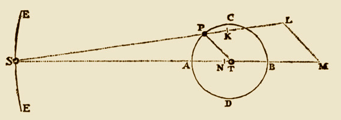

# Doodson tidal wave components



## doodson.m
This function gives the parameters for about 60 main wave components of Earth tides due to Sun and Moon (annual, semiannual, monthly, fortnightly, diurnal, semidiurnal, ...) using the harmonic development of Arthur Thomas Doodson [1890-1968]. For a given wave, it returns in a structure the 6 Doodson's arguments, wave Darwin's symbol, wave description name and the wave period in days.

Type `doodson` without argument to display all available waves, and their associated doodson number and period.

### Examples
```matlab
>> doodson
    N: 055.565, 6798.4 days
   Sa: 056.554, 365.26 days
  Ssa: 057.555, 182.621 days
...
   S4: 491.555, 0.25 day
   M6: 655.555, 0.172508 day
   M8: 855.555, 0.129381 day
>> X=doodson('M2')
   X =
     symbol: {'M2'}
       name: {'Principal lunar semidiurnal'}
    doodson: [2 0 0 0 0 0]
     period: 0.5175
```


## Author
**François Beauducel**, [IPGP](www.ipgp.fr), [beaudu](https://github.com/beaudu), beauducel@ipgp.fr

## Documentation
Type `doc doodson` for syntax and examples. See also [](https://fr.mathworks.com/matlabcentral/fileexchange/46735-doodson-tidal-wave-components) for users community comments.
